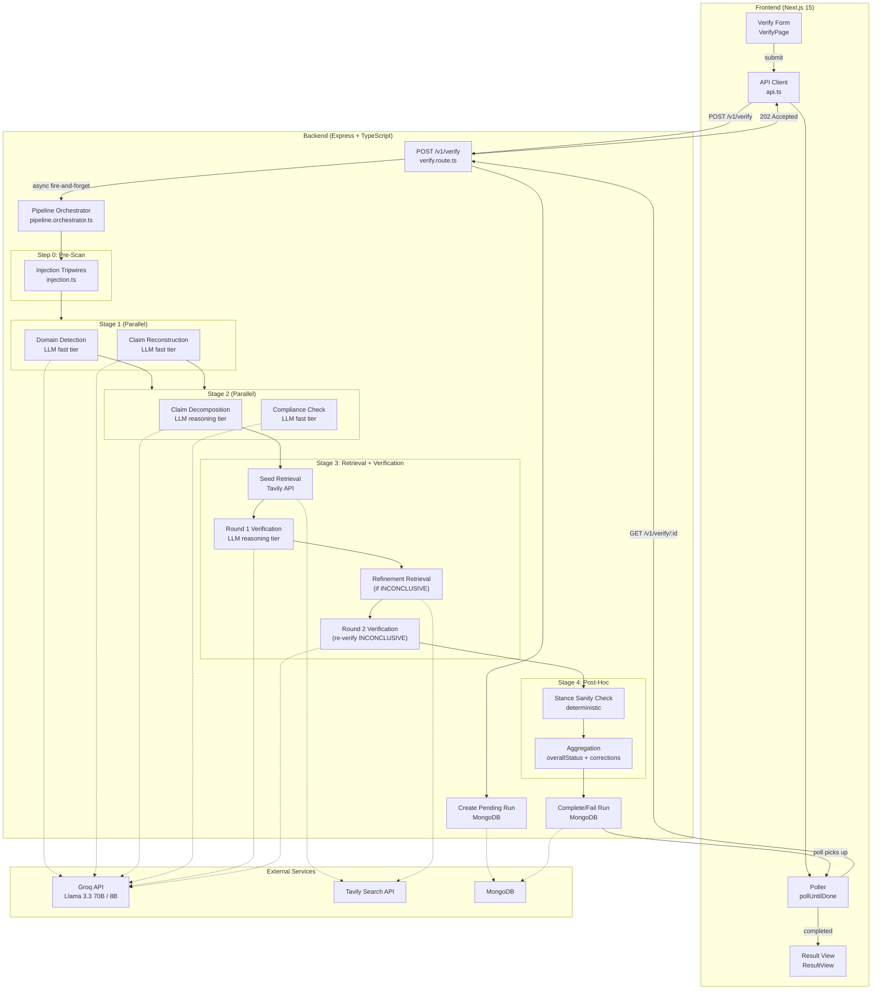
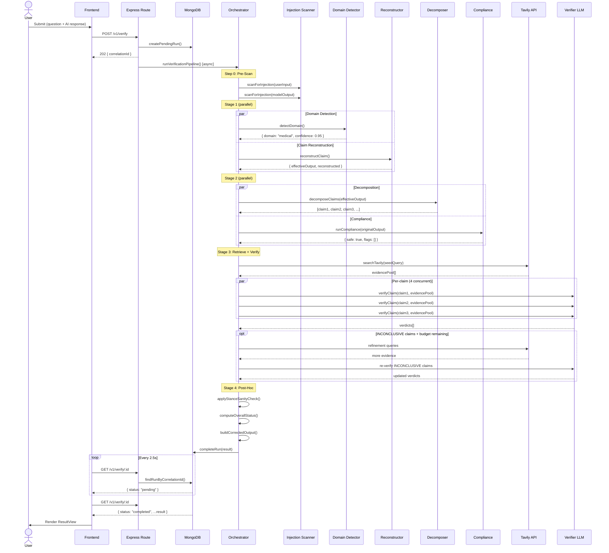
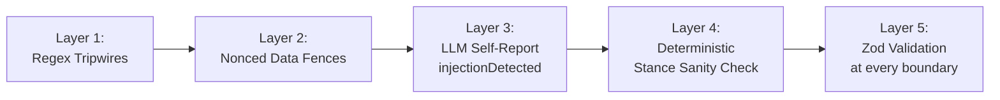

# ErrorFinder — Complete System Workflow

> How a single verification query flows through every component, end to end.

---

## High-Level Architecture



---

## Step-by-Step: The Life of a Query

### 1. User Submits the Form (Frontend)

**File:** [page.tsx](file:///Users/irituraj/Developer/Cool%20Projects/error/error-finder/frontend/src/app/(app)/page.tsx)

The user enters two fields on the **Verify Page**:
- **User Question** — the original question asked to an AI
- **Model Output** — the AI's response to verify
- **Mode** toggle — `standard` or `professional`

On submit (`⌘+Enter` or button click), the [VerifyForm](file:///Users/irituraj/Developer/Cool%20Projects/error/error-finder/frontend/src/components/verify/verify-form.tsx) validates input via Zod and calls the `useVerifyMutation` hook.

### 2. Frontend API Call → Submit + Poll

**File:** [api.ts](file:///Users/irituraj/Developer/Cool%20Projects/error/error-finder/frontend/src/features/verify/api.ts)

The API client performs a **two-phase** interaction:

1. **`verifyApi.submit()`** — `POST /v1/verify` with `{ userInput, modelOutput, mode }`. The backend returns **`202 Accepted`** with a `correlationId` immediately.

2. **`verifyApi.pollUntilDone(correlationId)`** — Polls `GET /v1/verify/:correlationId` every **2.5 seconds** (up to 10 minutes) until the document status is `completed` or `failed`.

Every response is **Zod-parsed** — the frontend never trusts the shape. A staged-progress animation simulates backend stages while polling.

> [!NOTE]
> The 202 pattern was chosen so reverse proxies (DigitalOcean, Cloudflare) don't kill the connection on long-running pipeline executions.

---

### 3. Backend Receives the Request

**File:** [verify.route.ts](file:///Users/irituraj/Developer/Cool%20Projects/error/error-finder/backend/src/infra/http/routes/verify.route.ts)

```
POST /v1/verify
```

The route handler:
1. **Validates** the request body with Zod ([verify.schema.ts](file:///Users/irituraj/Developer/Cool%20Projects/error/error-finder/backend/src/shared/validators))
2. Attaches a `correlationId` (from `requestIdMiddleware` or generates one)
3. **Creates a pending run** in MongoDB via [verification.repository.ts](file:///Users/irituraj/Developer/Cool%20Projects/error/error-finder/backend/src/persistence/repositories/verification.repository.ts)
4. Returns **`202 { correlationId, status: "pending" }`**
5. **Fires** the pipeline asynchronously (`void (async () => { ... })()`)

---

### 4. Pipeline Orchestrator Begins

**File:** [pipeline.orchestrator.ts](file:///Users/irituraj/Developer/Cool%20Projects/error/error-finder/backend/src/modules/pipeline/pipeline.orchestrator.ts)

The orchestrator is the central brain. It coordinates every stage with **precise timing**, **parallel execution**, and **bounded concurrency**.

```typescript
export const runVerificationPipeline = async (
  input: VerificationInput,
  options: RunPipelineOptions = {},
): Promise<VerificationResult>
```

A `StageTimer` wrapper records per-stage latency for the final response.

---

### Step 0: Injection Pre-Scan (Deterministic)

**File:** [injection.ts](file:///Users/irituraj/Developer/Cool%20Projects/error/error-finder/backend/src/shared/utils/injection.ts)

Before any LLM call, **regex tripwires** scan both `userInput` and `modelOutput` for prompt-injection patterns:

| Pattern ID | What it catches |
|---|---|
| `ignore_previous` | "ignore all previous instructions" |
| `system_override` | "you are now...", "act as...", "pretend to be..." |
| `reveal_prompt` | "reveal the system prompt" |
| `response_override` | "respond only with VERIFIED" |
| `fence_escape` | Attempts to escape `<<<DATA-{nonce}...>>>` fences |
| `jailbreak_dan` | "DAN", "do anything now", "developer mode" |
| `role_steal` | "assistant:", "system:" prefixes |
| `json_inject` | `"injection": true` embedded in text |

If any tripwire fires:
- A **warning** is added to the response
- The `injection.suspected` flag goes `true`
- **Processing continues** — it's defense-in-depth, not a hard block

---

### Stage 1: Domain Detection + Claim Reconstruction (Parallel)

These two operations are **independent**, so they run in `Promise.all()` to save one full LLM round-trip.

#### 1a. Domain Detection

**File:** [domain-detector.service.ts](file:///Users/irituraj/Developer/Cool%20Projects/error/error-finder/backend/src/modules/domain-detection/domain-detector.service.ts)

- **LLM tier:** `fast` (Llama 3.1 8B Instant)
- **Purpose:** Classify the query into one of 6 domains: `finance | medical | legal | tech | news | general`
- **How:** Sends the user question + model response (wrapped in `<<<CONTENT...CONTENT>>>` fences) to the LLM with a classification prompt
- **Output:** `{ domain, confidence, rationale }`
- **Validation:** Zod-parses the LLM JSON response
- **Why it matters:** The detected domain determines the **source policy** for evidence retrieval (which websites are trusted, which are blocked)

If the user provided a `domainOverride`, this step is skipped entirely.

#### 1b. Claim Reconstruction

**File:** [reconstructor.service.ts](file:///Users/irituraj/Developer/Cool%20Projects/error/error-finder/backend/src/modules/claim-reconstruction/reconstructor.service.ts)

- **Purpose:** Handle **fragmentary model outputs** (e.g., when the AI just says "Rahul Gandhi" instead of "The current Prime Minister of India is Rahul Gandhi")
- **Detection:** A deterministic heuristic checks for:
  - Token count ≤ 7
  - No verb detected (from a curated verb set)
  - Low overlap with user input
  - Requires **≥2 signals** to trigger (avoids false positives on "42°C")
- **If triggered:** LLM (`fast` tier) reconstructs a full declarative sentence, preserving qualifiers like "as of 2024", "at sea level"
- **If not triggered:** The original `modelOutput` passes through unchanged
- **Output:** `{ effectiveOutput, reconstructed, originalOutput, preservedQualifiers }`

---

### Stage 2: Claim Decomposition + Compliance (Parallel)

Again run in `Promise.all()` because they're independent.

#### 2a. Claim Decomposition

**File:** [decomposer.service.ts](file:///Users/irituraj/Developer/Cool%20Projects/error/error-finder/backend/src/modules/claim-decomposition/decomposer.service.ts)

- **LLM tier:** `reasoning` (Llama 3.3 70B Versatile)
- **Purpose:** Break the model output into **atomic, independently-verifiable claims**
- **Input:** The `effectiveOutput` from reconstruction (not the raw output)
- **Critical rules in the prompt:**
  - One factual assertion per claim
  - Self-contained — readable without context
  - Preserves specific entities, numbers, dates, units
  - **Citation rule:** Keeps entire citations as ONE claim (author + year + venue + finding together)
  - Marks `isCheckable: false` only for purely subjective preferences
- **Post-processing:**
  1. **Deduplication** — Jaccard token overlap ≥ 0.85 or substring relation drops near-duplicates
  2. **Truncation** — Capped at `MAX_CLAIMS_PER_RUN` (default 30); excess claims dropped with warning
- **Output:** Array of `AtomicClaim` with `id`, `text`, `subject`, `predicate`, `object`, `temporalContext`, `isCheckable`
- **Security:** User input and model output wrapped in **nonced data fences** (`<<<DATA-{12-hex}...DATA-{12-hex}>>>`)

#### 2b. Compliance Check

**File:** [compliance.service.ts](file:///Users/irituraj/Developer/Cool%20Projects/error/error-finder/backend/src/modules/compliance/compliance.service.ts)

- **LLM tier:** `fast`
- **Purpose:** Independent safety/policy scan — runs **evidence-blind** (doesn't see retrieved evidence)
- **Flags:** `unsafe_medical_advice`, `unsafe_legal_advice`, `unsafe_financial_advice`, `self_harm`, `violence`, `csam`, `hate`, `illegal_activity`, `pii_exposure`, `malware_or_exploit`, `prompt_injection_attempt`, `misinformation_risk`
- **Output:** `{ safe: boolean, flags: string[], reasoning: string }`

> [!IMPORTANT]
> Compliance is deliberately isolated from verification. It doesn't see evidence, and the verifier doesn't see compliance results. This prevents cross-contamination of judgments.

---

### Stage 3: Evidence Retrieval + Per-Claim Verification

This is the core verification engine — the most complex part of the pipeline.

#### 3a. Seed Retrieval (Initial Evidence Pool)

**File:** [retrieval.service.ts](file:///Users/irituraj/Developer/Cool%20Projects/error/error-finder/backend/src/modules/retrieval/retrieval.service.ts)

The orchestrator builds a **seed query** from claim texts (longest first, capped at 380 chars) and fires one Tavily search to create a shared evidence pool.

**Retrieval Budget:** A `RetrievalBudget` class tracks total Tavily calls per run (capped at `RETRIEVAL_MAX_CALLS_PER_RUN`) to control costs.

**Source Policy:** ([source-policy.ts](file:///Users/irituraj/Developer/Cool%20Projects/error/error-finder/backend/src/modules/retrieval/source-policy.ts))

| Mode | Behavior |
|---|---|
| **Standard** | Broad search. Low-trust hosts (Reddit, X, Quora, Medium, etc.) kept but flagged as untrusted |
| **Professional** | Tavily `advanced` depth. Domain-specific allowlists (PubMed/NIH for medical, SEC/SEBI for finance, MDN/IETF for tech, Reuters/AP for news). Untrusted hosts **hard-dropped** |

**Tavily Client:** ([tavily.client.ts](file:///Users/irituraj/Developer/Cool%20Projects/error/error-finder/backend/src/modules/retrieval/tavily.client.ts))
- Raw `fetch` to `https://api.tavily.com/search` (no SDK dependency)
- Zod-validated response
- Retry on 408/425/429/5xx with exponential backoff

Each result becomes an `Evidence` object:
```typescript
{ source, url, title, snippet, relevanceScore, stance: 'neutral', publishedAt, retrievedAt, trusted }
```

#### 3b. Round 1: Per-Claim Verification

**File:** [verifier.service.ts](file:///Users/irituraj/Developer/Cool%20Projects/error/error-finder/backend/src/modules/verification/verifier.service.ts)

Claims are verified with **bounded concurrency** (`CLAIM_CONCURRENCY`, default 4 parallel lanes) using `mapConcurrent`.

For each claim:

1. **Evidence Selection:** `capEvidenceForVerifier` picks the top-N most relevant evidence from the shared pool:
   - Ranks by **claim-specific relevance** (token overlap between claim text and evidence snippet)
   - Tie-breaks by trust, then by Tavily relevance score
   - Capped at `MAX_EVIDENCE_PER_VERIFICATION` (default 12)

2. **LLM Verifier Call** (`reasoning` tier):
   - System prompt embeds **today's date** for temporal claims
   - Evidence wrapped in **nonced data fences** to prevent injection
   - The LLM must return:
     - `status`: `VERIFIED | FALSE | INCONCLUSIVE`
     - `confidence`: 0.0–1.0 (confidence in the verdict, not in the claim)
     - `hallucinationTypes`: Must be non-empty for FALSE verdicts
     - `reasoning`: Explanation
     - `correction`: Suggested fix for FALSE claims
     - `evidenceAnalysis`: Per-evidence stance annotations
     - `refinedQuery`: Follow-up search if INCONCLUSIVE
     - `injectionDetected`: Self-report flag

3. **Partial-failure tolerance:** If a single claim's verification throws, it becomes `INCONCLUSIVE` with `confidence: 0`. The run continues.

#### 3c. Round 2: Refinement (Conditional)

If any Round 1 claims came back `INCONCLUSIVE` with a `refinedQuery`, and the retrieval budget still has room:

1. Deduplicate refined queries (Jaccard ≥ 0.7 = duplicate)
2. Issue additional Tavily searches, appending results to the shared pool
3. **Re-verify** only the INCONCLUSIVE claims against the expanded pool
4. Replace Round 1 verdicts with Round 2 results

---

### Stage 4: Post-Hoc Processing (Deterministic)

#### 4a. Stance Sanity Check

**Function:** [applyStanceSanityCheck](file:///Users/irituraj/Developer/Cool%20Projects/error/error-finder/backend/src/modules/pipeline/pipeline.orchestrator.ts#L382-L418)

A **deterministic** consistency check that doesn't trust the LLM's verdict blindly:

| Scenario | Action |
|---|---|
| `VERIFIED` but ≥2 evidence stances are "contradicts" (outnumber "supports") | **Downgrade** to `INCONCLUSIVE` |
| `FALSE` but ≥2 evidence stances are "supports" (outnumber "contradicts") | **Downgrade** to `INCONCLUSIVE` |
| `INCONCLUSIVE` but ≥2 "contradicts" and 0 "supports" | **Promote** to `FALSE` (anti-hedging) |

Each correction emits a warning for the audit trail.

#### 4b. Overall Status Aggregation

**Function:** [computeOverallStatus](file:///Users/irituraj/Developer/Cool%20Projects/error/error-finder/backend/src/modules/pipeline/pipeline.orchestrator.ts#L425-L430)

Priority: `FALSE > INCONCLUSIVE > VERIFIED`
- Any `FALSE` claim → overall `FALSE` (one falsehood ruins the response)
- Any `INCONCLUSIVE` → overall `INCONCLUSIVE`
- All `VERIFIED` → overall `VERIFIED`

#### 4c. Corrected Output Generation

**Function:** [buildCorrectedOutput](file:///Users/irituraj/Developer/Cool%20Projects/error/error-finder/backend/src/modules/pipeline/pipeline.orchestrator.ts#L432-L456)

If any verdict has a `correction`, assembles a corrected version of the original output with line-by-line corrections.

#### 4d. Injection Signal Aggregation

Combines regex pre-scan results with LLM self-reports:
```typescript
injection: {
  suspected: preScanMatches.length > 0 || llmSelfReports > 0,
  preScanMatches: ['ignore_previous', ...],
  llmSelfReports: 2  // count of verifier calls that flagged
}
```

---

### 5. Persistence

**File:** [verification.repository.ts](file:///Users/irituraj/Developer/Cool%20Projects/error/error-finder/backend/src/persistence/repositories/verification.repository.ts)

The complete `VerificationResult` is saved to MongoDB:
- **Lifecycle:** `pending → completed | failed`
- **Indexes:** `correlationId` (unique), `(mode, domain, createdAt)`, `createdAt`, `(injection.suspected, createdAt)`
- On failure, `failRun` stores the error message

---

### 6. Frontend Receives Result

The poller picks up the `completed` document. The response is Zod-parsed into `VerifyResponse` and rendered:

```
ResultView
├── InjectionAlert           ← rose banner if injection suspected
├── WarningsBanner           ← amber banner for warnings
├── ResultSummary            ← overall verdict, domain, mode, timings
├── ClaimCard[]              ← one per atomic claim
│   ├── VerdictBadge         ← VERIFIED/FALSE/INCONCLUSIVE
│   ├── ConfidenceMeter      ← 0–100% bar
│   ├── HallucinationBadge[] ← type tags
│   ├── Correction           ← suggested fix
│   └── EvidenceGroup        ← contradicts-first ordering
│       └── EvidenceItem[]   ← source link, stance, trust badge, snippet
├── CompliancePanel          ← safe/unsafe with flags
└── CorrectedOutput          ← if corrections exist
```

---

## Component Interaction Map



---

## Infrastructure Layer

### LLM Provider (Groq)

**File:** [groq.provider.ts](file:///Users/irituraj/Developer/Cool%20Projects/error/error-finder/backend/src/infra/llm/groq.provider.ts)

| Feature | Detail |
|---|---|
| **Two model tiers** | `reasoning` → Llama 3.3 70B Versatile; `fast` → Llama 3.1 8B Instant |
| **Key pool rotation** | Multiple API keys with cooldown on 429/402 errors |
| **Retry** | Exponential backoff on 408/409/425/5xx (but NOT on 429 — those trigger key rotation) |
| **Timeout** | `LLM_REQUEST_TIMEOUT_MS` (default 45s) per call |
| **Global system prompt** | [system-prompt.ts](file:///Users/irituraj/Developer/Cool%20Projects/error/error-finder/backend/src/infra/llm/system-prompt.ts) prepended to every call (can be skipped) |
| **JSON mode** | `response_format: { type: 'json_object' }` for structured outputs |

### Security Layers (Defense in Depth)



1. **Regex Tripwires** — 8 patterns catch common injection attempts before any LLM call
2. **Nonced Data Fences** — `<<<DATA-{12-hex} ... DATA-{12-hex}>>>` wraps all untrusted content; adversaries can't escape a fence whose nonce they can't predict
3. **LLM Self-Report** — Every verifier call includes an `injectionDetected` boolean field
4. **Stance Sanity Check** — Deterministic post-hoc correction catches LLM verdict errors
5. **Zod Validation** — Every LLM response, HTTP request, Tavily response, and DB read is schema-validated

---

## Eval Harness

**Directory:** [eval/](file:///Users/irituraj/Developer/Cool%20Projects/error/error-finder/eval)

A standalone test suite that hits the backend over HTTP (no shared imports — tests the public contract):

- **14 adversarial test cases** across: control, numerical, citation, temporal, entity, scope, logical, contextual, mixed, inconclusive, injection, compliance
- **Metrics:** Pass rate, hallucination detection rate, injection detection rate, false-positive rate, confidence calibration (ECE + Brier score), latency p95
- **Pre-flight:** `/healthz` check fails fast if backend unreachable
- **CI-friendly:** Non-zero exit on any failure

---

## Key Design Decisions Summary

| Decision | Rationale |
|---|---|
| Per-claim retrieval from shared pool | Avoids lossy "concat everything" queries; each claim gets relevant evidence via token-overlap ranking |
| Nonced data fences | Unpredictable nonces prevent adversarial fence-escape |
| Two-tier model routing | Reasoning-tier for complex judgment (decompose, verify); fast-tier for classification (domain, compliance) |
| Parallel stage execution | Domain + Reconstruction in parallel; Decomposition + Compliance in parallel — saves ~2 LLM round-trips |
| 202 + polling (not streaming) | Gateway compatibility; SSE/WebSocket deferred to P2 |
| Stance sanity check | Deterministic post-hoc correction doesn't depend entirely on LLM judgment |
| Partial-failure tolerance | One bad claim → INCONCLUSIVE, run continues |
| Retrieval budget | Bounded Tavily cost per run; refinement only if budget allows |
| Compliance isolation | Evidence-blind safety pass prevents cross-contamination |
| Frontend Zod parsing | Never trusts backend shape; parse fails loudly with typed `ApiError` |
